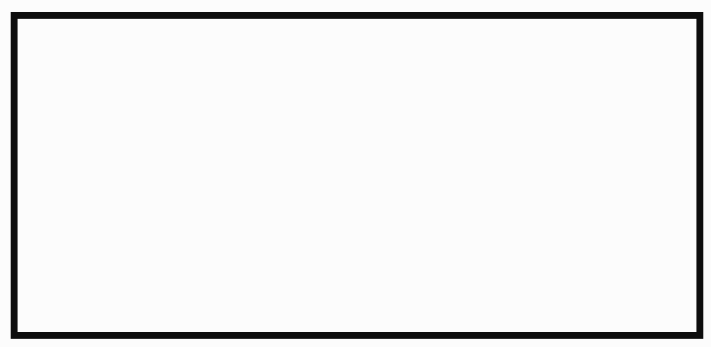
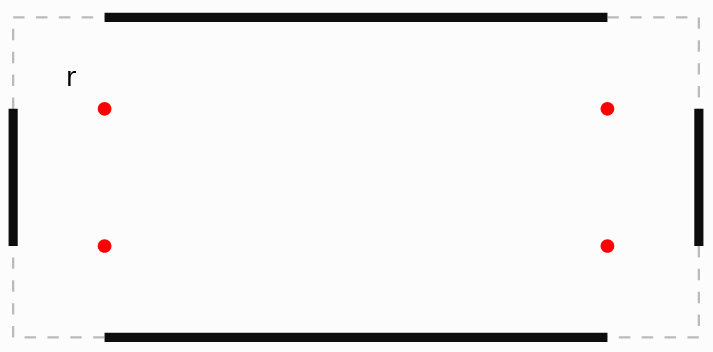

- **Generalised Bresenham's line algorithm**
  - Wikipedia link: https://en.wikipedia.org/wiki/Bresenham's_line_algorithm

  - Psuedo Code
    ```
    plotLine(x0, y0, x1, y1)
        dx = abs(x1 - x0)
        sx = x0 < x1 ? 1 : -1
        dy = -abs(y1 - y0)
        sy = y0 < y1 ? 1 : -1
        error = dx + dy

        while true
            plot(x0, y0)
            e2 = 2 * error
            if e2 >= dy
                if x0 == x1 break
                error = error + dy
                x0 = x0 + sx
            end if
            if e2 <= dx
                if y0 == y1 break
                error = error + dx
                y0 = y0 + sy
            end if
        end while
    ```

- **Midpoint Circle algorithm**
  - Link: https://medium.com/@dillihangrae/mid-point-circle-algorithm-84f5971dcd08
  - Psuedo Code

    ```
    plot_symmetric_points(cx, cy, x, y)
        draw(cx + x, cy + y)
        draw(cx - x, cy + y)
        draw(cx + x, cy - y)
        draw(cx - x, cy - y)

        draw(cx + y, cy + x)
        draw(cx - y, cy + x)
        draw(cx + y, cy - x)
        draw(cx - y, cy - x)

    plotCircle(cx, cy, r)
        x = 0
        y = r
        dp = 1 - r // decision parameter

        while x <= y
            plot_symmetric_points(cx, cy, x, y)
            x = x + 1
            if dp < 0
                dp = dp + (2 * x) + 1
            else
                y = y - 1
                dp = dp + (2 * x) - (2 * y) + 1
            end if
        end while
    ```

- **Rounded Rectangle**
  - Diagrams:

    
    

  - Logic

    ```
        1) First create 4 lines (Look for black bar in diagram)
            1.1) Top Line
                Start: x+r, y
                End: (x+width-1)-r, y
            1.2) Bottom Line
                Start: x+r, y+height-1
                End: (x+width-1)-r, (y+height-1)
            1.3) Left Line
                Start: x, y+r
                End: x, (y+height-1)-r
            1.4) Right Line
                Start: (x+width-1), y+r
                End: (x+width-1), (y+height-1)-r

        2) Draw arc for radis r in each corner (Look for red dot in diagram)
            2.1) Top Left Arc
                Center: x+r, y+r
            2.2) Bottom Left Arc
                Center: x+r, (y+height-1)-r
            2.3) Top Right Arc
                Center: (x+width-1)-r, y+r
            2.4) Bottom Right Arc
                Center: (x+width-1)-r, (y+height-1)-r
    ```

- **Icons**
  1. Go to [google fonts](https://fonts.google.com/icons) and download svg file
  2. Place the svg file inside Graphics/Icons/svg
  3. Run icon_conveter.py file in converter folder

- **Fonts**
  1. Download ttf and place it inside Graphics/Fonts/ttf_and_c
  2. Go to [lvgl font converter](https://lvgl.io/tools/fontconverter)

     2.1) Upload the ttf file

     2.2) Provide file name

     2.3) Select bits per pixel as 4

  3. Place the dowloaded c file inside Graphics/Fonts/ttf_and_c and change extension from .c to .txt
  4. Run font_extractor.py file in converter folder
